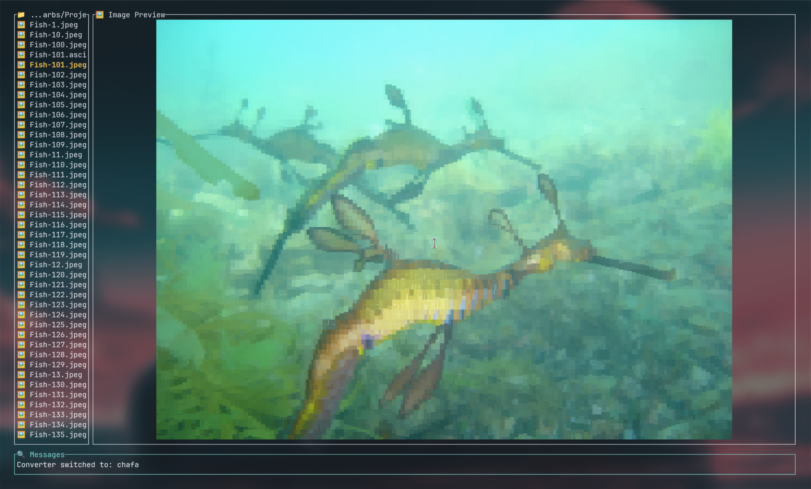

PTUI - Picture TUI
==================

A terminal-based image viewer written in Rust that provides a file browser
interface with real-time image preview capabilities.




Features
--------
- Support for common image formats
- Real-time image preview using ANSI terminal graphics
- Support for kitty and iTerm2 graphical converters (works on Ghostty and iTerm2)
- Multiple picture-to-text converters: chafa and jp2a supported so far
- Dynamically switch between converters by pressing TAB
- Slide show mode with arrow-key support and transitions (transitions only with jp2a)
- Navigate with arrow keys or vim-style j/k
- Enter directories with Enter, go back with Backspace
- Multilingual support (English, German, Spanish, French, Japanese, Chinese)
- Dynamic window resizing with [ and ] keys and when terminal changes
- Caching of rendered images for performance
- Scrollable file lists for directories with many files
- Support for both image and text file preview
- Open in file system browser (if available)
- Delete file
- Save picture to ascii
- Sort by date asc/desc or name
- Dynamic reloading of configuration

Requirements
------------
- chafa - For converting images to ANSI/terminal output
- ImageMagick (identify command) - For image dimension detection
- jp2a - for displaying images in jp2a text output
- nasm (for building fast-jpeg)

Installation
------------

From Source on Arch Linux:

    git clone https://github.com/narbs/ptui.git; cd ptui
    yay -S cargo
    cargo build --features fast-jpeg --release
    cargo install --path .

From Source on Mac:

    git clone https://github.com/narbs/ptui.git; cd ptui
    brew install rust
    cargo build --features fast-jpeg --release
    cargo install --path .

From AUR (Arch Linux):

    yay -S ptui-bin

From Homebrew (Linux or Mac):

    brew install narbs/homebrew-tap/narbs-ptui

Usage
-----
    ptui


Controls:
```
    Arrow Keys / j,k  - Navigate file list
    Enter             - Enter directory
    Backspace         - Go to parent directory
    [ / ]             - Resize preview window
    space             - Start Slideshow (Arrows work here too)
    x                 - Delete file
    s                 - Save file to ascii
    d, n              - Sort by date (toggle newest/oldest), n: Sort by name
    Home/End          - Home: Go to start, End: Go to end
    o                 - Open in system file browser (if available)
    q / Ctrl+C        - Quit
    TAB               - Cycle between converters
    ?                 - Help
```

Configuration
-------------
On Linux, the configuration file is automatically created at ~/.config/ptui/ptui.json
On a Mac the configuration file is created here: "$HOME/Library/Application Support/ptui/ptui.json"

Edits refresh in the app automatically.

Example chafa configuration:

```json
{
  "converter": {
    "chafa": {
      "format": "ansi",
      "colors": "full"
    },
    "jp2a": {
      "colors": true,
      "invert": false,
      "dither": "none",
      "chars": null
    },
    "graphical": {
      "filter_type": "lanczos3"
    },
    "selected": "chafa"
  },
  "locale": "en",
  "slideshow_delay_ms": 2000,
  "slideshow_transitions": {
    "enabled": false,
    "effect": "scattering",
    "frame_duration_ms": 50
  }
}
```

Example jp2a configuration with slide show transitions:

```json
{
  "converter": {
    "chafa": {
      "format": "ansi",
      "colors": "full"
    },
    "jp2a": {
      "colors": true,
      "invert": false,
      "dither": "none",
      "chars": null
    },
    "graphical": {
      "filter_type": "lanczos3",
      "max_dimension": 512,
      "auto_resize": true
    },
    "selected": "graphical"
  },
  "locale": "en",
  "slideshow_delay_ms": 2000,
  "slideshow_transitions": {
    "enabled": false,
    "effect": "scattering",
    "frame_duration_ms": 50
  }
}
```

Building
--------
    cargo build      - Compile the project
    cargo run        - Build and run
    cargo test       - Run tests
    cargo check      - Quick syntax checking
    cargo clean      - Remove build artifacts

License
-------
MIT License - see LICENSE file for details

Author
------
Christian Clare

Repository
----------
https://github.com/narbs/ptui
