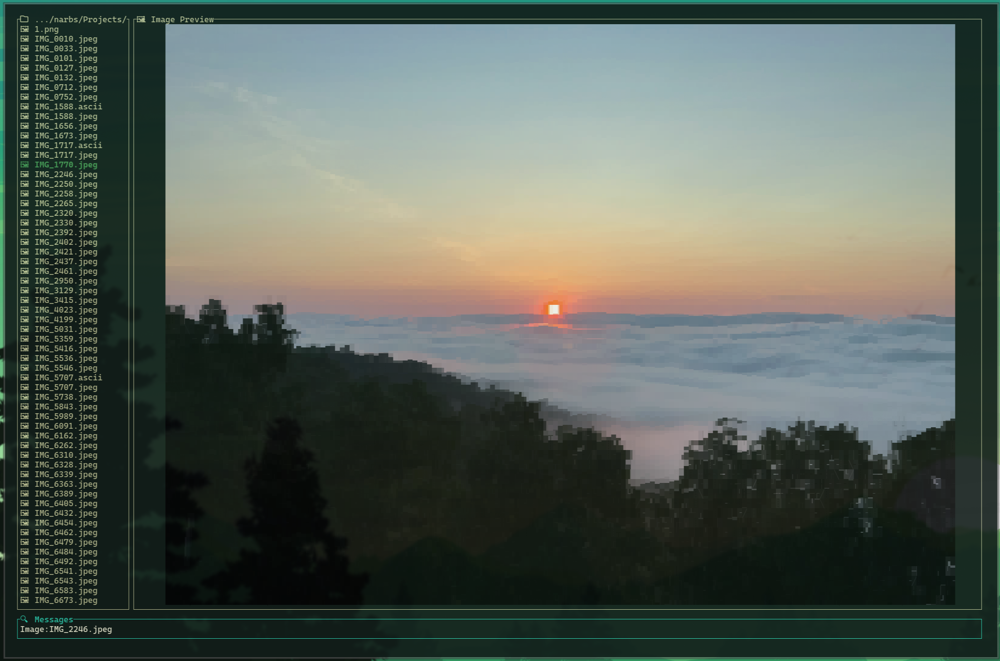
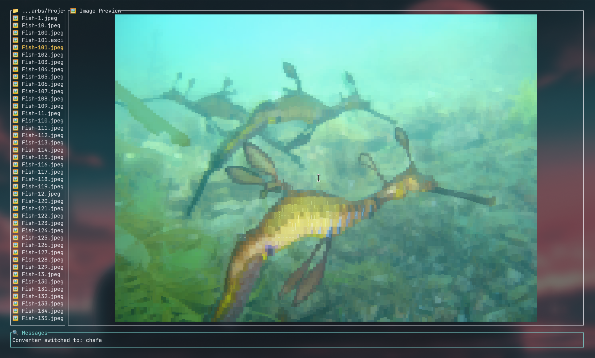

PTUI - Picture TUI
==================

A terminal-based image viewer written in Rust that provides a file browser
interface with real-time image preview capabilities.






Features
--------
- Support for common image formats
- Real-time image preview using ANSI terminal graphics
- Support for kitty and iTerm2 graphical converters (works on Ghostty and iTerm2)
- Multiple picture-to-text converters: chafa and jp2a supported so far
- Dynamically switch between converters by pressing TAB
- Slide show mode with arrow-key support and transitions (transitions only with jp2a)
- Navigate with arrow keys or vim-style j/k
- Enter directories with Enter, go back with Backspace
- Multilingual support (English, German, Spanish, French, Japanese, Chinese)
- Dynamic window resizing with [ and ] keys and when terminal changes
- Caching of rendered images for performance
- Scrollable file lists for directories with many files
- Support for both image and text file preview
- Open in file system browser (if available)
- Delete file
- Save picture to ascii
- Sort by date asc/desc, name asc/desc, or star rating best-first/unrated-first
- Star ratings stored as XMP sidecars, readable by darktable, digiKam and Lightroom
- Dynamic reloading of configuration

Requirements
------------
- chafa - For converting images to ANSI/terminal output
- ImageMagick (identify command) - For image dimension detection
- jp2a - for displaying images in jp2a text output
- nasm (for building fast-jpeg)

Installation
------------

From Source on Arch Linux:

    git clone https://github.com/narbs/ptui.git; cd ptui
    yay -S cargo
    cargo build --features fast-jpeg --release
    cargo install --locked --path .

From Source on Mac:

    git clone https://github.com/narbs/ptui.git; cd ptui
    brew install rust
    cargo build --features fast-jpeg --release
    cargo install --locked --path .

From AUR (Arch Linux):

    yay -S ptui-bin

From Homebrew (Linux or Mac):

    brew install narbs/homebrew-tap/narbs-ptui

Usage
-----
    ptui


Controls:
```
    Arrow Keys / j,k  - Navigate file list
    Enter             - Enter directory
    Backspace         - Go to parent directory
    [ / ]             - Resize preview window
    space             - Start Slideshow (Arrows work here too)
    x                 - Delete file
    c                 - Copy file to a folder
    m                 - Move file to a folder
    i                 - Save file to ascii
    0-5 / *           - Rate the selected file (0 clears, * rates 5)
    d, n, s           - Sort by date (newest/oldest), name (A-Z/Z-A) or rating (best/unrated first)
    Home/End          - Home: Go to start, End: Go to end
    o                 - Open in system file browser (if available)
    q / Ctrl+C        - Quit
    TAB               - Cycle between converters
    ?                 - Help
```

Star ratings
------------
Press `1` to `5` to rate the selected file, `0` to clear the rating, or `*` as a shortcut
for five. The rating shows as a star and a number in the file list.

Press `s` to sort by rating. The first press puts the best first and unrated files last;
pressing it again reverses that, so unrated files come first and the best last. `d` and `n`
still sort by date and name, and files sharing a rating are ordered by name.

Ratings are stored in XMP sidecar files - a small `.xmp` file next to the image, holding
the standard `xmp:Rating` property. This is the same format darktable, digiKam,
RawTherapee, Adobe Bridge and Lightroom use, so ratings made in ptui show up in those
programs, sync with the images through Dropbox or rsync, and survive a move to another
machine. Neither extended attributes nor a private database can do that.

The trade-off is that ptui creates files in your image folders, so the first time you rate
something in a folder it asks, and remembers your answer for that folder. Answer `n` and
ratings for that folder are kept privately in `~/.local/share/ptui/state.json` instead
(on a Mac, under `$HOME/Library/Application Support`), where they work but do not sync or
show up anywhere else. To skip the question, set `stars.sidecars`
in the config to `"always"` or `"never"`:

```json
{
  "stars": {
    "sidecars": "ask"
  }
}
```

Both sidecar naming conventions are read:

```
    photo.jpg.xmp     appended  (darktable, digiKam)
    photo.xmp         replaced  (Adobe tools)
```

ptui writes whichever one a folder already uses, and the appended form otherwise, since
`photo.jpg` and `photo.png` in one folder would both map to `photo.xmp` under the replaced
convention. Sidecars belonging to a file in the folder are hidden from the list; one whose
image is gone stays visible so you can see it and delete it.

An existing sidecar is never overwritten, only updated. Sidecars written by other programs
can hold a great deal more than a rating - darktable keeps an entire edit history in
them - so ptui changes `xmp:Rating` and `xmp:MetadataDate` and leaves everything else
exactly as it found it. Deleting a file deletes its sidecar too, and copying or moving a
file takes its sidecar along.

Copying and moving files
------------------------
Press `c` (copy) or `m` (move) with a file selected to choose a destination folder.
A numbered list of shortcuts appears - the last folder you copied or moved to, followed
by the standard folders that exist on your system (home, desktop, downloads, documents,
pictures and a projects folder if you have one). Press the matching number to pick one.

The final number in the list switches to free-text path entry, where `~` is expanded and
relative paths are resolved against the folder you are browsing. Ctrl+U clears the line
and Esc goes back to the list.

The file is copied or moved as soon as the folder is chosen. The one exception is when a
file of the same name is already there - then you are asked to confirm the overwrite with
`y` first.

The last destination you used is remembered between sessions in
`~/.local/share/ptui/state.json` (on a Mac, under `$HOME/Library/Application Support`),
so repeating a copy to the same folder is a couple of key presses.

Configuration
-------------
On Linux, the configuration file is automatically created at ~/.config/ptui/ptui.json
On a Mac the configuration file is created here: "$HOME/Library/Application Support/ptui/ptui.json"

Edits refresh in the app automatically.

Example chafa configuration:

```json
{
  "converter": {
    "chafa": {
      "format": "ansi",
      "colors": "full"
    },
    "jp2a": {
      "colors": true,
      "invert": false,
      "dither": "none",
      "chars": null
    },
    "graphical": {
      "filter_type": "lanczos3"
    },
    "selected": "chafa"
  },
  "locale": "en",
  "slideshow_delay_ms": 2000,
  "slideshow_transitions": {
    "enabled": false,
    "effect": "scattering",
    "frame_duration_ms": 50
  }
}
```

Example jp2a configuration with slide show transitions:

```json
{
  "converter": {
    "chafa": {
      "format": "ansi",
      "colors": "full"
    },
    "jp2a": {
      "colors": true,
      "invert": false,
      "dither": "none",
      "chars": null
    },
    "graphical": {
      "filter_type": "lanczos3",
      "max_dimension": 512,
      "auto_resize": true
    },
    "selected": "graphical"
  },
  "locale": "en",
  "slideshow_delay_ms": 2000,
  "slideshow_transitions": {
    "enabled": false,
    "effect": "scattering",
    "frame_duration_ms": 50
  }
}
```

Building
--------
    cargo build      - Compile the project
    cargo run        - Build and run
    cargo test       - Run tests
    cargo check      - Quick syntax checking
    cargo clean      - Remove build artifacts

License
-------
MIT License - see LICENSE file for details

Author
------
Christian Clare

Repository
----------
https://github.com/narbs/ptui
